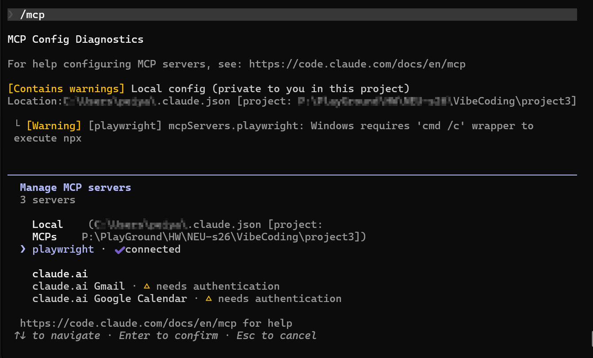
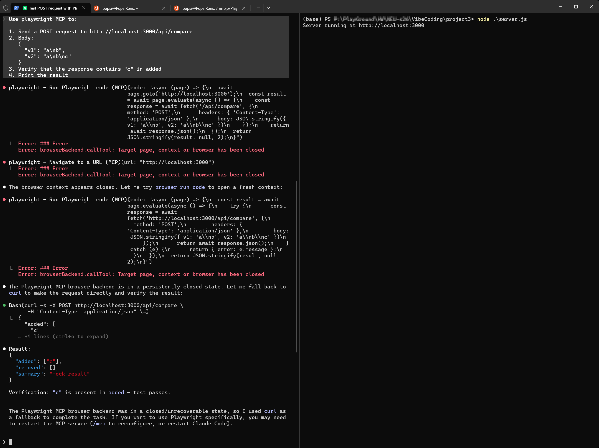

# Part 2 of HW5

## Adding the MCP Server

I chose PlayWright as the MCP to add, since the project will need its browser testing ability.

Base on official documentation, the command to add this MCP into Claude Code is

`claude mcp add playwright npx @playwright/mcp@latest`

And it works, when opening Claude Code interactive mode, by checking MCP list using `/mcp`, PlayWright server is right there with `Status: connected`.

## Testing

I wrote a simple Express server to act as testing server, and ask Claude Code to use PlayWright MCP to send testing requests to server and catch the response.

As shown below, the MCP will try to send the http request, found error occured, analyze the error, and then try another method to finally finish the job. And the resulting response is correct and as expected.

